# Visual Parity Evidence

This directory keeps public, reviewable visual harness evidence from the
`windows-native-screenshot.yml` workflow and local macOS strict visual runs.
The current GitHub workflow captures Windows-hosted reference PNGs from public
fixtures. The matching macOS runtime render, pixel diff, and threshold failure
checks are produced locally on a developer Mac with `winui3-mac-runner` when a
visual scenario needs review.

Important: the checked-in `windows-reference.png` examples are not native WinUI
renders of the fixture projects yet. They are useful for validating the public
capture/comparison harness, but they must not be used as native WinUI visual
parity proof or to promote component grades.

The checked-in public admin workbench synthetic probe example artifacts come
from public GitHub Actions run
[`26752174485`](https://github.com/MarlonJD/winui3-mac-test-runtime/actions/runs/26752174485)
on commit `b6604c1`. The checked-in component parity lab synthetic probe
examples come from public GitHub Actions run
[`26757799015`](https://github.com/MarlonJD/winui3-mac-test-runtime/actions/runs/26757799015)
on commit `72c3148`.

## How To Read The Metrics

Lower values are better.

| Metric | Meaning |
| --- | --- |
| `changedPixelPercentage` | Percent of pixels that are not byte-identical between reference and macOS output. Anti-aliasing and text rasterization can move this number even when the layout is close. |
| `meanAbsoluteError` | Average per-channel color error across the image. This is usually the best quick signal for broad visual similarity. |
| `rootMeanSquaredError` | Error metric that penalizes larger color differences more strongly. |
| `maxChannelDelta` | Largest single-channel color delta. A value of `255` can be caused by one high-contrast edge and does not imply the whole image is unrelated. |

Passing strict comparison means the scenario stayed inside its documented
thresholds. It is not a claim of arbitrary WinUI 3 pixel-perfect compatibility.
It also is not a component-quality claim by itself: a whole screenshot can pass
while an individual `CommandBar`, `InfoBar`, `ListView`, icon, or resource
feature remains visibly weak. Component lab scenarios must publish
`component-evidence.json` and keep visibly weak controls labeled `weak` or
`poor` until native WinUI public reference artifacts justify a stronger grade.

Component visual grades:

| Grade | Meaning |
| --- | --- |
| `good` | Close to Windows with only minor text or edge differences. |
| `usable` | Recognizable and functionally correct, but native chrome differs. |
| `weak` | Structure exists, but important visual details are missing or simplified. |
| `poor` | Visibly wrong, collapsed, misplaced, or misleading. |
| `not-rendered` | Diagnostic-only, planned, Windows-only, or unsupported. |

## Current Public Evidence

| Scenario | Status | Changed pixels | Exact unchanged pixels | MAE | RMS | What matches | Known differences |
| --- | --- | ---: | ---: | ---: | ---: | --- | --- |
| `shell-light` | synthetic probe / passed | 4.00% | 96.00% | 1.57 | 14.20 | Navigation shell geometry, pane selection, text hierarchy, card surfaces. | Reference is synthetic probe output; text rasterization and edge anti-aliasing differ from Windows. |
| `interactions-light` | synthetic probe / passed | 31.69% | 68.31% | 4.06 | 17.77 | Interaction result state, list/text/image layout, binding-driven updates. | Reference is synthetic probe output; many pixels change because text and small control edges render differently on the two platforms. |
| `control-gallery-light` | synthetic probe / passed | 6.49% | 93.51% | 1.67 | 12.69 | Supported public controls, high-level spacing, checked/progress/info states. | Reference is synthetic probe output; native control chrome, exact typography, and Fluent focus/hover details are approximated. |
| `public-admin-workbench-light` | synthetic probe smoke / weak visual parity | 16.01% | 83.99% | 8.50 | 41.09 | Windows-targeted source ingestion, navigation, selected state, workbench list/detail shape, command click assertion. | The reference is synthetic probe output, not native WinUI. The macOS renderer still simplifies parts of the command bar, InfoBar, list/detail cards, exact text metrics, Fluent depth, and native control chrome. |

Component lab scenario artifacts are produced for:
`component-basic-input-light`, `component-text-forms-light`,
`component-collections-light`, `component-dialogs-flyouts-light`,
`component-commands-menus-light`, `component-navigation-workbench-light`,
`component-status-pickers-light`, and `component-layout-media-light`.
Each artifact folder includes `component-evidence.json` alongside
`visual-run.json` when produced by the public workflow.

## Public Admin Workbench Example

These files are copied from the public workflow artifact for
`public-admin-workbench-light`. The `windows-reference.png` file is a
Windows-hosted synthetic probe reference, not a native WinUI fixture capture.

| Synthetic Windows probe reference | macOS runtime | Pixel diff |
| --- | --- | --- |
| 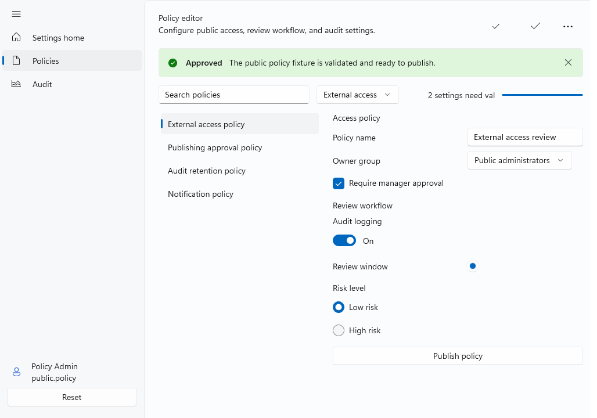 | 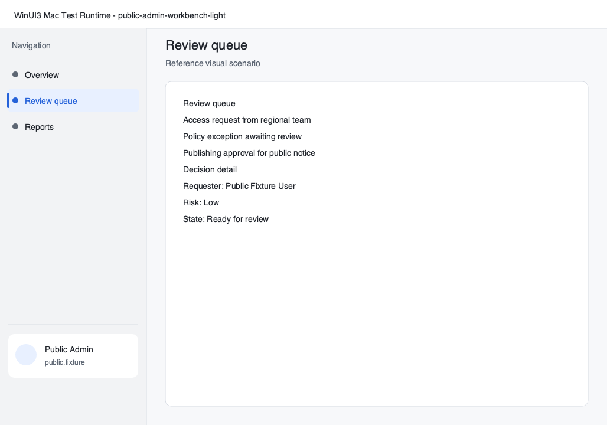 |  |

The example is useful for the current alpha milestone because it passes the
scenario thresholds and keeps the core shell/workbench structure recognizable.
It should still be read as synthetic probe smoke and source-ingestion smoke
evidence, not native WinUI visual parity evidence. The diff makes the remaining
work visible: exact Fluent control rendering, text metrics, command surfaces,
InfoBar layout, shadows, materials, focus visuals, pointer states, and richer
list/detail painters still need
cataloged implementation work before stronger parity claims can be made.

## Component Parity Lab Examples

These examples show synthetic Windows probe output beside the current macOS
runtime rendering from this library. The visual tables are meant to make the
state of the component lab easy to inspect in the repository;
`component-evidence.json` inside each example folder remains the component-level
source of truth. Component grades must not be promoted until native WinUI
Windows reference artifacts exist.

### Basic Input

| Synthetic Windows probe reference | macOS runtime | Pixel diff |
| --- | --- | --- |
| 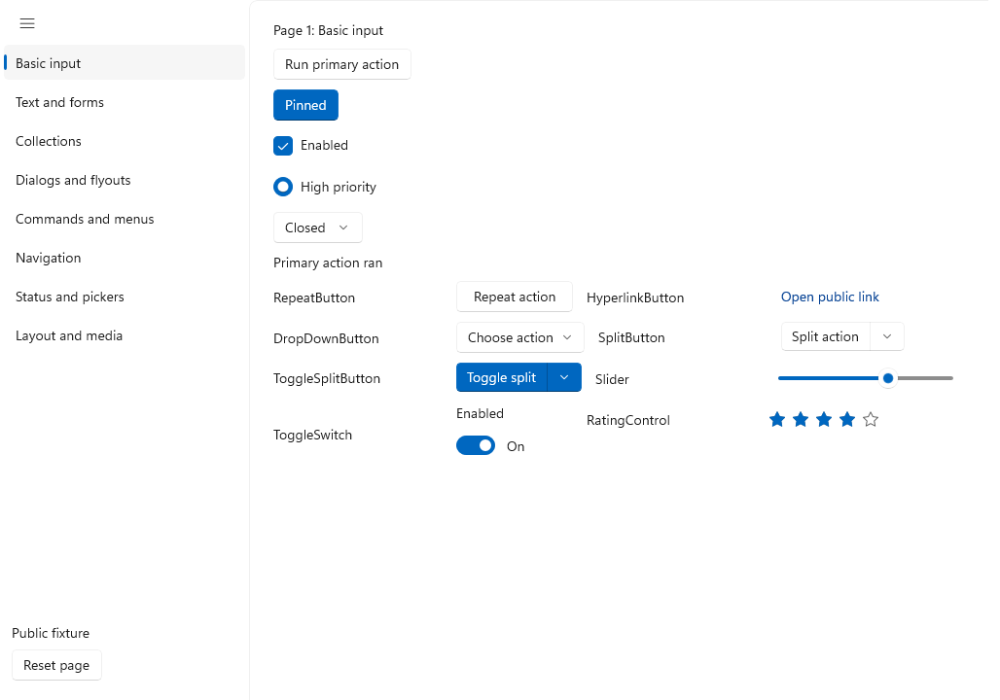 | 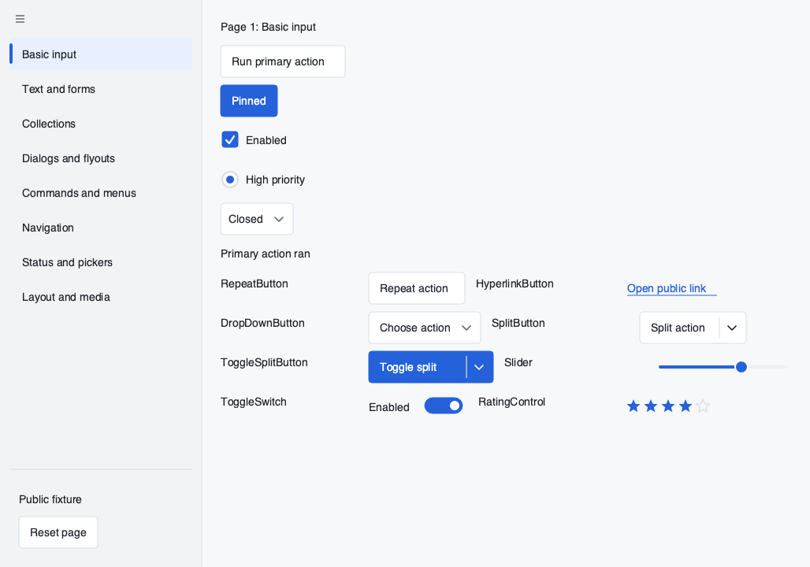 | 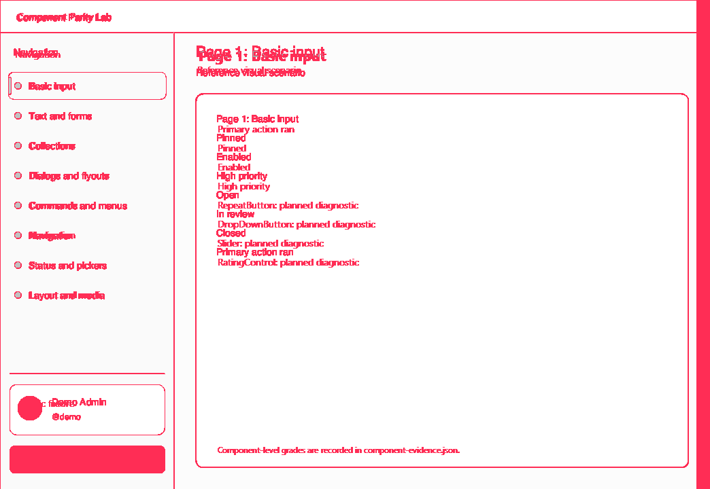 |

`component-basic-input-light` currently records 13 component requirements: 5
are `usable` and 8 are `not-rendered` planned diagnostics.

### Commands And Menus

| Synthetic Windows probe reference | macOS runtime | Pixel diff |
| --- | --- | --- |
| 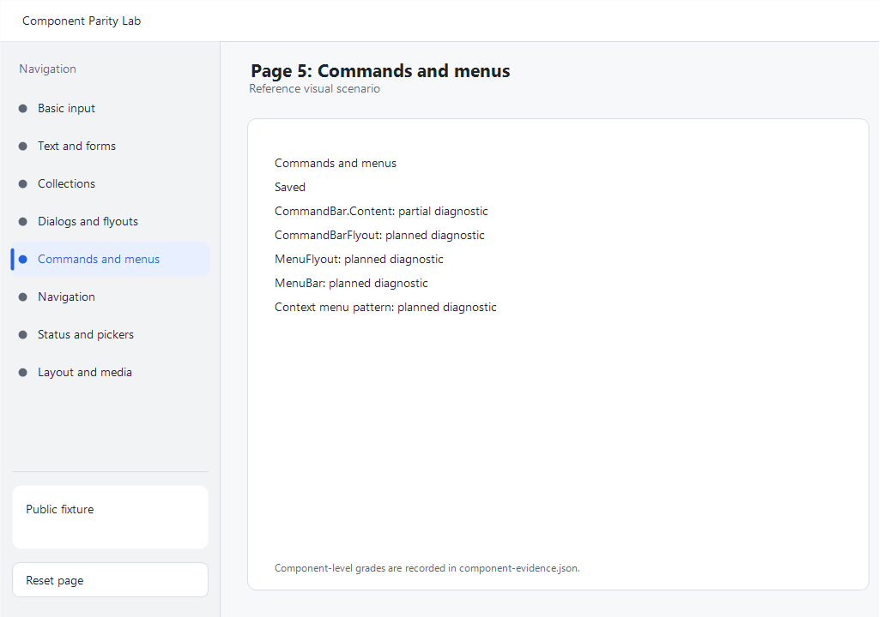 | 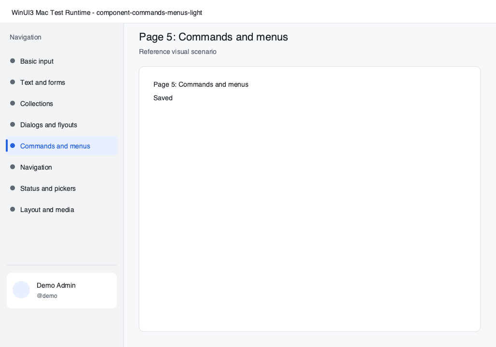 | 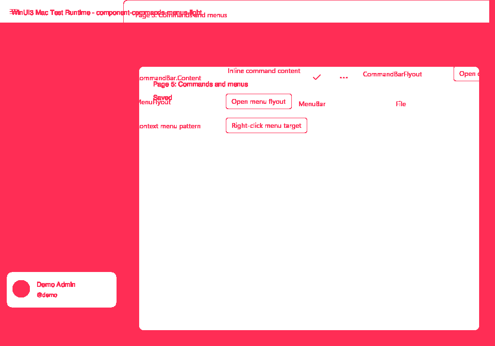 |

`component-commands-menus-light` currently records 8 component requirements: 3
are `weak` and 5 are `not-rendered`. The weak items are `CommandBar`,
`AppBarButton`, and `AppBarButton.Icon`.

### Layout, Media, And Resources

| Synthetic Windows probe reference | macOS runtime | Pixel diff |
| --- | --- | --- |
| 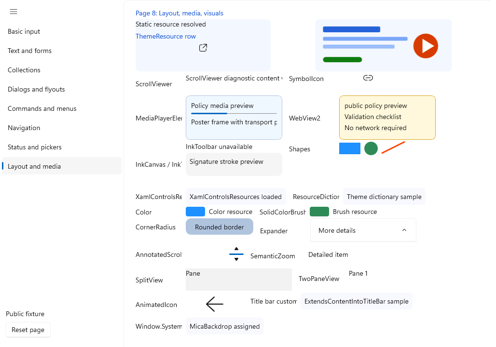 | 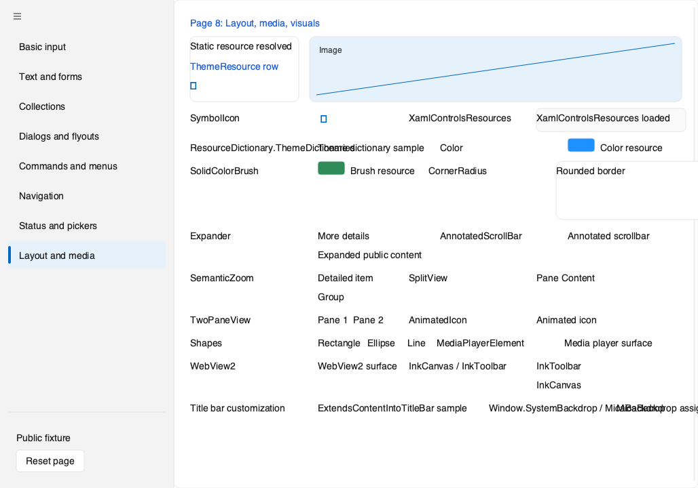 | 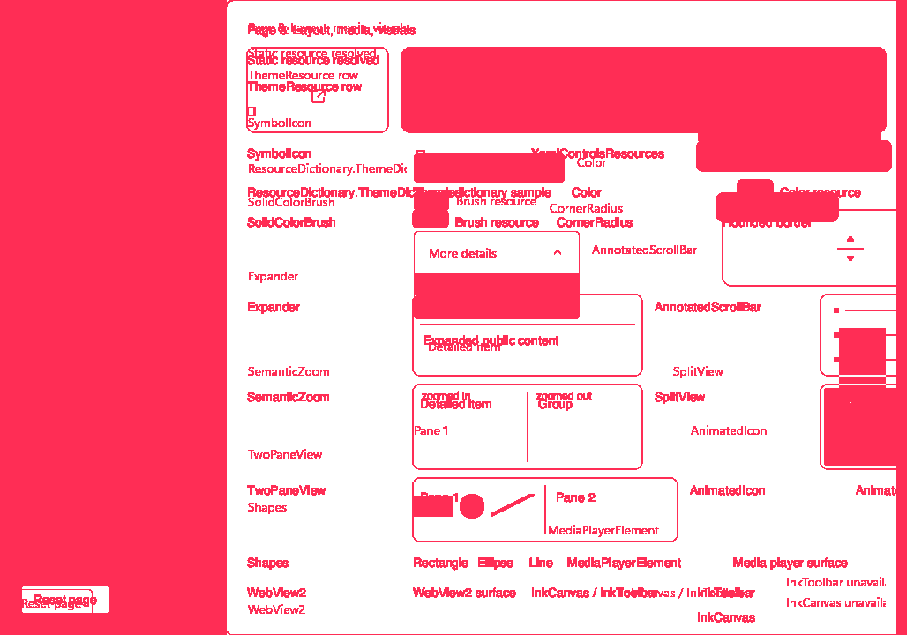 |

`component-layout-media-light` currently records 28 component or source-feature
requirements: 6 are `usable`, 4 are `weak`, and 18 are `not-rendered`. The weak
items include `Grid`, `Border`, `FontIcon`, and `Image`; planned source
features such as `Window.SystemBackdrop / MicaBackdrop` remain diagnostic-only.

## Updating Evidence

When a visual scenario or renderer behavior changes:

1. Run the local strict scenario without a reference.
2. Trigger `windows-native-screenshot.yml` on the public repository.
3. Download the `windows-reference-screenshots` artifact.
4. Re-run the matching local strict scenario with `--reference` and
   `--diff-output`.
5. Inspect `windows-reference.png`, `mac-runtime.png`, `pixel-diff.png`, and
   `visual-run.json`; inspect `component-evidence.json` for component lab
   scenarios, and inspect reference provenance when the reference supplies it.
6. Update the relevant example folder only when the artifact is public and does
   not contain private names, private screenshots, secrets, or proprietary
   fixture content. Production visual examples must come from native WinUI
   reference provenance; synthetic probe examples must remain labeled as smoke
   evidence.
